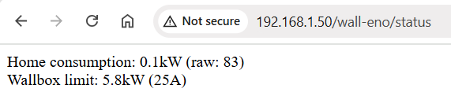

# wall-eno 🤖

If you're so unlucky to have the only EV charger in the world that doesn't support dynamic power control
(i.e. [this one](https://www.siemens.com/global/en/products/energy/emobility/versicharge.html)) and you want to avoid power interruptions,
don't worry and install `wall-eno` 😃.

`wall-eno` will constantly read the power consumption from your home and adjust the charging current limit of the wallbox accordingly.
`wall-eno` is specific for **VersiCharge AC Wallbox**, that supports custom commands via ModBus TCP protocol.

## Bill of Material 💸

- [VersiCharge AC Wallbox](https://support.industry.siemens.com/cs/attachments/109782228/versicharge_wallbox_operating_instructions_it-IT_it-IT.pdf) (reference manual: [ModBus Map](https://support.industry.siemens.com/cs/document/109814359/versicharge-ac-series-modbus-map?dti=0&lc=en-DE))
- [Arduino Uno](https://store.arduino.cc/products/arduino-uno-rev3)
- [Ethernet Shield](https://store.arduino.cc/products/arduino-ethernet-shield-2)
- [Arduino IDE](https://www.arduino.cc/en/software/) (tested with v2.3.4)
- [Hall current sensor](https://it.aliexpress.com/item/1005004559647888.html) (Input: AC 0-50A, Output: 0-5V)
- Patience
- Free time

Your Arduino controller board and wallbox need to be connected to the same local network (I suggest to use a simple Ethernet switch).

Also, the wallbox needs to be connected to Internet for better control (from mobile app).
Pro tip: if you don't have network in your garage you can try a pair of Powerline adapters to bring network from your home,
assuming your home and garage are under the same electric power line (i.e. same electric meter).

## Initial setup 🛠️

Plug your Ethernet Shield on top of the Arduino Uno board.

Install Arduino IDE and verify that everything works by using some sketch available from `File` -> `Examples`.

Verify that your wallbox is connected and accepts Modbus commands via TCP (assuming `192.168.1.200` is the IP address of the wallbox):
```shell
echo -e -n '\x00\x00\x00\x00\x00\x06\x02\x03\x00\x00\x00\x05' | nc -q 0 192.168.1.200 502 | hexdump -C
```
The response from the wallbox should contain the manufacturer's name (e.g. `Siemens AG`).

Note: all the manual commands proposed here have been tested from a Linux environment (also WSL from Windows is fine).

## Configure programming via network 🌐

If your Arduino controller board is placed in your garage, you can still program the board and test your changes comfortably from your home desk.
This is easier if your home and garage share the same local network, but in case this is not an option then the board might also be programmed remotely
(it requires separate Internet access for your garage network, some basic port forwarding and a dynamic DNS like [DuckDNS](https://www.duckdns.org/)).

Follow these steps:
- Setup an ISP programmer (I used an additional Arduino Uno board programmed with [ArduinoISP](https://docs.arduino.cc/built-in-examples/arduino-isp/ArduinoISP/) sketch)
- Take latest release available from [ariadne-bootloader](https://github.com/loathingKernel/ariadne-bootloader/releases)
- Extract the archive and copy the inner `hardware` folder directly into your [Arduino sketchbook folder](https://support.arduino.cc/hc/en-us/articles/4412950938514-Open-the-Sketchbook-folder)
- Download also the `libraries` folder from my forked [ariadne-bootloader](https://github.com/gentooise/ariadne-bootloader) repository and copy it into your sketchbook folder (next to `hardware`)
  - My fork of `ariadne-bootloader` extends the `EthernetReset` library to support a convenient auto-refreshing web page to show the controller status ([changes](https://github.com/gentooise/ariadne-bootloader/commit/4ddccec2b4ba1376b7e67b0f411612485b38f1f5))
- Restart Arduino IDE: `Ariadne Bootloader (in Sketchbook)` entry should appear under `Tools` -> `Board` menu
- Connect programmer and target boards together as shown in [ArduinoISP](https://docs.arduino.cc/built-in-examples/arduino-isp/ArduinoISP/) and connect programmer board to your PC
- Under `Tools`:
  - select `Arduino Uno` board from the list in `Ariadne Bootoader (in Sketchbook)`
  - select serial `Port` of programmer board (it appears after connecting the board to your PC)
  - select one of the standard versions under `Version`, depending on the Ethernet chip in use (Wiznet `W5100`, `W5200`, `W5500`, you can see it on your Ethernet Shield)
  - select `Arduino as ISP` under `Programmer`
  - click on `Burn Bootloader` (this will burn `ariadne-bootloader` into your target board)
- After bootloader has been burned correctly, the programmer board is no longer necessary and you can connect the target board directly to your PC for the next step
- Open the `WriteNetworkSettings` sketch from `File` -> `Examples` -> `NetEEPROM(Ariadne-Bootloader)`
- Configure the sketch parameters according to your network settings and upload it to your board
  - Note: since the bootloader does not support DHCP you have to select a static IP address for your board, and reserve that address within your home router configuration
  - Example: set `192.168.1.1` as GW address (e.g. your home router) and use `192.168.1.50` for your board IP address
  - Set a "password" string that you will use later to send remote reset/reprogram requests (in my case I just set it to `wall-eno`)
  - Upload the sketch to your board

# Configure and upload wall-eno 🤖

From now on, the board is now ready to be programmed via Ethernet. For that, you will need a TFTP Client since the sketch must be uploaded manually (Arduino IDE does not support this).
First of all, open `wall-eno.ino` sketch in Arduino IDE and adjust the code to your scenario:
- set your WallBox IP address (default: `192.168.1.200`)
- set the pin which your hall current sensor is attached to (default: `A0` [analog 0])
- set the maximum current supported by your hall sensor (default: `50A`)
- set max power from your home energy supply contract (default: `6kW`)

Enable verbose output in Arduino IDE from `File` -> `Preferences` and click `Verify`.
At the end of the compilation you should see the full path of the `wall-eno.ino.elf` file being generated.
You can copy the `.elf` file into your working directory and give the following command to convert it to a raw binary:
```shell
/full/path/to/avr-objcopy.exe -O binary -R .eeprom "wall-eno.ino.elf" "wall-eno.ino.bin"
```
and to upload it to the board:
```shell
tftp -v -m octet 192.168.1.50 69 -c put wall-eno.ino.bin
```
The `/full/path/to/avr-objcopy.exe` can also be taken from Arduino IDE compilation logs.
When running the `tftp` command, the board must be waiting for a reprogram: the first time you need to press the reset button on the board.
After wall-eno has been uploaded a first time, you can modify/reprogram it anytime by just connecting to `192.168.1.50/<password>/reprogram`
(where `<password>` is the string that you set up previously in `WriteNetworkSettings` step, e.g. `wall-eno`).

If you are on a Linux environment, you can reuse the following bash functions to program wall-eno and check the status (you can put them in your bash profile):
```shell
walleno_upload() {
    elf_path="put-the-path-here" # take "wall-eno.ino.elf" full path from Arduino IDE compilation logs
    objcopy_path="put-the-path-here" # take "avr-objcopy" executable full path from Arduino IDE compilation logs
    if [ -f "$elf_path" ]; then
        cp "$elf_path" .
        "$objcopy_path" -O binary -R .eeprom "wall-eno.ino.elf" "wall-eno.ino.bin"
        if curl 192.168.1.50/wall-eno/reprogram 2> /dev/null | sed '/^</d'; then
            sleep 3 # wait for reset
            tftp -v -m octet 192.168.1.50 69 -c put wall-eno.ino.bin
        fi
    fi
}

walleno_status() {
    UPLINE=$(tput cuu1)
    ERASELINE=$(tput el)
    rewrite=''
    lines=0
    while : ; do
        status=$(curl -s 192.168.1.50/wall-eno/status | tr -d '\r' | sed '/^</d')
        for i in $(seq $lines); do echo -n "$UPLINE$ERASELINE"; done
        echo "$status"
        lines=$(echo "$status" | wc -l)
        sleep 1
    done
}
```

## Use wall-eno ⚡

Assuming that your board is reachable at `192.168.1.50` IP address and you set `<password>` string to `wall-eno`,
you should be able to communicate with your board through the following web pages:

- `http://192.168.1.50/wall-eno/reset`: restart wall-eno board (e.g. useful in case of ModBus errors)
- `http://192.168.1.50/wall-eno/reprogram`: reset board to wait for new upload (`wall-eno` won't be available until you upload it again via tftp)
- `http://192.168.1.50/wall-eno/status`: get the latest status/error message reported by `wall-eno`

If everything works correctly, the status page will show in real time the power absorbed from your home and the
charging current limit that is given to the wallbox:



### Calibration 📐

The power consumption measured from your home might not be precise enough and you will likely need to calibrate the values
according to the signal received by your hall current sensor on the analog pin.

Follow the comment in `rawToWatt` function in the `wall-eno.ino` code to understand how to calibrate the power measurement for your environment.

Enjoy! ⚡🔋🚗
